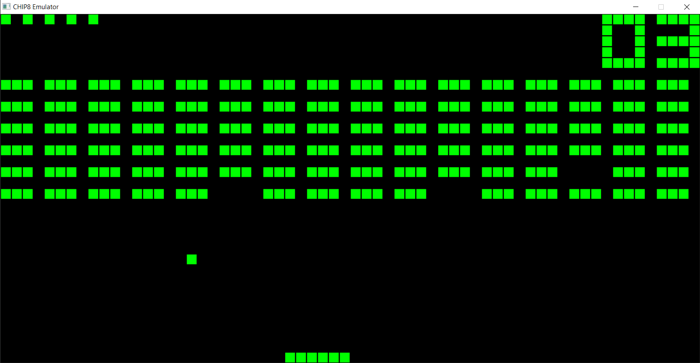
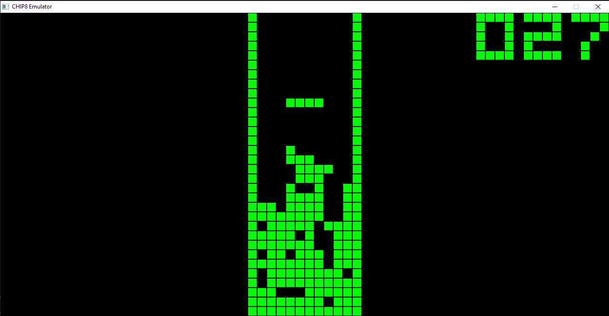
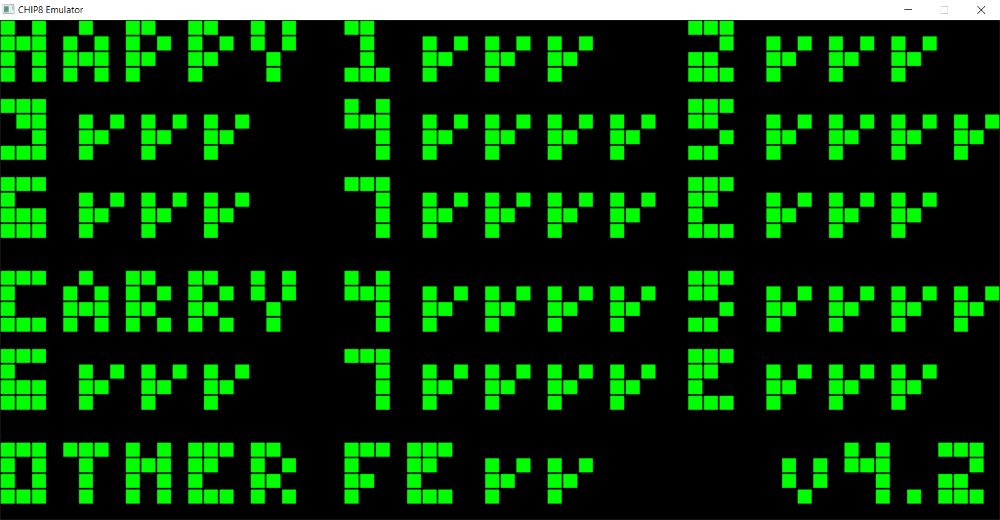

# Chip8 Emulator
An emulator for the Chip8 VM which can be read about [here](https://en.wikipedia.org/wiki/CHIP-8). This emulator also implements sound. 
<i>Note: This emulator does not have Super-Chip-8 support</i>

This entire project only uses the standard library and SDL2 which will need to be installed 
The SDL installation instructions can be found [here](https://wiki.libsdl.org/SDL2/Installation)

## Getting it Running

Ensure that you have the `SDL.dll` file in the project directory and that the SDL library is in the `src/` directory. After that just run `make` in the project directory to compile and build the executable. `make debug` will build a version of the executable with debug output, but note that the emulator does run noticably slower with debug output.

### Running a ROM
You can run a rom from the command line with the command `$ .\main.exe '.\roms\[ROM NAME].ch8'`. The keyboard mapping is shown below: 
| CHIP8 Keypad                                                              | QWERTY Mapping                                                                                                           |
|---------------------------------------------------------------------------|--------------------------------------------------------------------------------------------------------------------------|
| 1 2 3 C 4 5 6 D 7 8 9 E A 0 B F ------- ------- ------- | 1 2 3 4 Q W E R A S D F Z X C V Restart Rom: Equals key Pause Emulator: Spacebar Quit Emulator: Escape |

## Notes

This Chip-8 emulator has been verified to pass all tests included in the [Timendus Chip8 test suite](https://github.com/Timendus/chip8-test-suite?tab=readme-ov-file). It also implenemts every quirk of the original Chip-8 system except for display wait since I implemented my own form of it.

## Images

